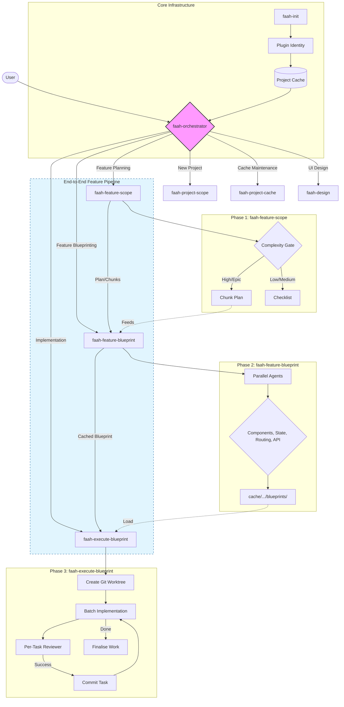

# 🗣️FAAH: Frontend Architecture Automation Hub

A Claude Code plugin for frontend architecture and feature planning. It investigates your codebase, caches what it learns, and produces structured blueprints that executor agents can implement in isolated workspaces.

---

## Installation & Onboarding

To use this plugin in Claude Code:

1. **Add to project**: Copy the `faah` plugin folder to your project or reference it in your Claude Code configuration.
2. **Learn project**: Run `/learn-project` to scan your codebase and build the persistent project context cache.
3. **Start planning**: Use the orchestrator by describing your architectural needs or feature goals.

---

## What it does

The plugin works in several distinct modes, each a separate skill invoked by the `faah-orchestrator` skill:

| Mode              | Skill                    | When to use                                                                                     |
| ----------------- | ------------------------ | ----------------------------------------------------------------------------------------------- |
| New project       | `faah-project-scope`     | Starting a frontend from scratch — stack selection, structure, state design                     |
| Feature plan      | `faah-feature-scope`     | Architecting a feature now — produces a plan for this session                                   |
| Feature blueprint | `faah-feature-blueprint` | Investigating a feature before touching code — produces a blueprint folder for a future session |
| Execute           | `faah-execute-blueprint` | Implementing a blueprint from the project cache in an isolated git worktree                     |

---

## General Flow

The `faah-orchestrator` follows a structured orchestration pattern, typically progressing through a pipeline for non-trivial features:



---

## Project Cache

Every investigation result is saved to a persistent per-project cache:

```
~/.claude/plugins/local/faah/cache/<project-key>/project-context.md
```

The cache stores the project's stack, folder structure, component patterns, state patterns, routing patterns, data fetching patterns, file naming conventions, and key rules.

**Once cached, no skill re-investigates the codebase unless you ask.** This keeps context windows lean and sessions fast.

### First time on a project

Run the learn command before using any `faah-` skill:

```
/learn-project
```

This dispatches a full scan agent, writes the cache, then tells you to `/clear` so the next session starts fresh with only the cache loaded — not the investigation noise.

### Refreshing the cache

```
/learn-project   →  choose R (Refresh)
```

Or say: _"refresh project cache"_ — the orchestrator routes to `faah-project-cache`.

---

## Commands

| Command              | Description                                                                              |
| -------------------- | ---------------------------------------------------------------------------------------- |
| `/learn-project`     | Scan the project, build the cache, then clear context                                    |
| `/execute-blueprint` | Execute a completed blueprint from the project cache (`cache/<project-key>/blueprints/`) |

Invoke any skill directly by describing what you want — the `faah-orchestrator` skill detects scope and routes automatically.

---

## Workflow: Blueprint a feature

The most powerful workflow. Use this when a feature is non-trivial and execution will happen in a separate session.

```
Session 1 (planning):
  /learn-project          → build cache, clear context
  faah-feature-blueprint    → investigate + produce blueprint (stored in project cache)

Session 2 (execution):
  /execute-blueprint      → load blueprint from project cache, implement in isolated worktree
```

### What a blueprint produces

Blueprints are stored under the **project cache**, not in the git repo:

```
~/.claude/plugins/local/faah/cache/<project-key>/blueprints/YYYY-MM-DD-<feature-name>/
├── README.md                  — orientation and feature summary
├── context.md                 — project pattern snapshot
├── requirements.md            — confirmed feature requirements
├── scope.md                   — complexity rating + chunk plan (if feature was split)
├── investigation/
│   ├── components.md          — component layer findings with exact code excerpts
│   ├── state.md               — store and composable findings
│   ├── routing.md             — route registration and nav findings
│   └── api.md                 — data fetching and service layer findings
├── affected-files.md          — every file to create/modify, with anchors and rationale
└── implementation-sequence.md — ordered task list grouped for parallel/sequential execution
```

The executor loads the blueprint from this cache path in a new session — no re-investigation needed.

---

## Workflow: Architect a feature (same session)

Use this for simpler features where you want a plan to implement yourself.

```
faah-feature-scope    → loads cache, runs complexity check, produces implementation checklist
```

`faah-feature-scope` includes a **complexity and scope analysis** phase. For High or Epic complexity features, it produces a chunk plan — splitting the feature into smaller, independently blueprintable units. This chunk plan can then feed directly into `faah-feature-blueprint` for more accurate, focused investigation.

---

## Investigation Agents

`faah-feature-blueprint` dispatches parallel read-only agents per domain:

| Agent      | Scope                                                | Context provided                                 |
| ---------- | ---------------------------------------------------- | ------------------------------------------------ |
| Components | Component files, module structure, template patterns | Stack + Component Patterns + File Naming         |
| State      | Global stores, composables, flow direction           | Stack + State Patterns + Key Conventions         |
| Routing    | Router config, nav components, auth guards           | Stack + Routing Patterns + Folder Structure      |
| API        | Query hooks, service files, mutation patterns        | Stack + Data Fetching Patterns + Key Conventions |

Each agent receives only the cache sections relevant to its domain — **fresh, targeted context** rather than a full dump.

---

## Session Resume

`faah-feature-blueprint` and `faah-execute-blueprint` write a `.progress` file after every phase. If a session is interrupted, the next run detects the in-progress work and offers to resume from where it left off — no work is lost.

---

## Plugin structure

```
faah/
├── commands/
│   ├── learn-project.md           — /learn-project command
│   └── execute-blueprint.md       — /execute-blueprint command
├── skills/
│   ├── faah-orchestrator/          — orchestrator (routes to sub-skills)
│   ├── faah-project-cache/          — cache load / save / invalidate
│   ├── faah-project-scope/          — new project architecture
│   ├── faah-feature-scope/          — feature plan (same session)
│   ├── faah-feature-blueprint/      — feature investigation + blueprint
│   ├── faah-execute-blueprint/      — blueprint execution in worktree
│   ├── faah-cache-manager/          — project cache utilities
│   ├── faah-design/           — visual implementation sub-skill
│   └── faah-worktrees/       | isolated workspace setup
├── agents/
│   └── blueprint-reviewer.md      — spec compliance reviewer agent
└── scripts/                       — plugin integrity and release scripts
```

---

## Rules the plugin enforces

- **Cache first** — never re-investigate what is already known
- **Fresh context per agent** — agents receive only relevant cache sections, not the full project dump
- **Complexity gates blueprints** — High/Epic features are split into chunks before blueprinting; smaller inputs produce more accurate outputs
- **Read-only investigation** — no source files are touched until the executor runs
- **Anchored file references** — every file in `affected-files.md` names the exact function/export/variable near the change, so the executor never has to guess where to edit
- **One commit per task** — executor commits after each completed and reviewed task
- **Stop on drift** — executor halts if a blueprint anchor no longer exists in the codebase and surfaces the discrepancy before proceeding
