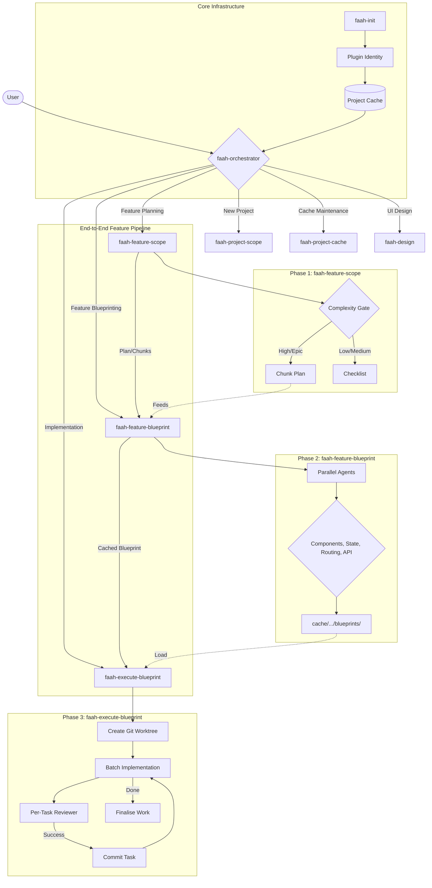

# 🗣️ FAAH: Frontend Architecture Automation Hub

A Claude Code plugin for frontend architecture and feature planning. FAAH investigates your codebase, caches what it learns, and produces structured blueprints that executor agents can implement in isolated workspaces — so you get faster, repeatable frontend architecture and feature planning without re-investigating every session.

---

## Quick links

- [Why this plugin exists](#why-this-plugin-exists)
- [What FAAH does](#what-faah-does)
- [Requirements](#requirements)
- [Installation](#installation)
- [Quickstart](#quickstart)
- [Commands](#commands)
- [Skills overview](#skills-overview)
- [Workflows](#workflows)
- [Project cache](#project-cache)
- [Architecture & internals](#architecture--internals)
- [Links & resources](#links--resources)
- [Contributing & support](#contributing--support)
- [License](#license)

---

## Why this plugin exists

Frontend architecture and feature planning often end up ad hoc: repeated codebase investigation, scattered decisions, and context lost between sessions. FAAH addresses this by:

- **Caching project context** — One learn pass captures stack, structure, and patterns; skills reuse the cache instead of re-scanning.
- **Orchestrated agents** — The orchestrator routes to the right skill (project scope, feature plan, blueprint, or execution) so you describe intent instead of micromanaging steps.
- **Structured blueprints** — Non-trivial features get a full blueprint (requirements, investigation, affected files, task sequence) stored in the project cache for a future session.
- **Isolated execution** — The executor runs in a git worktree with per-task review and commits, so implementation is traceable and resumable.

Use FAAH when you want consistent, cache-driven architecture and feature planning that scales across sessions and agents.

---

## What FAAH does

FAAH runs in several modes, each exposed as a skill and invoked by the `faah-orchestrator` when you describe what you want:

| Mode              | Skill                    | When to use                                                                                     |
| ----------------- | ------------------------ | ----------------------------------------------------------------------------------------------- |
| New project       | `faah-project-scope`     | Starting a frontend from scratch — stack selection, structure, state design                     |
| Feature plan      | `faah-feature-scope`     | Architecting a feature now — produces a plan for this session                                   |
| Feature blueprint | `faah-feature-blueprint` | Investigating a feature before touching code — produces a blueprint folder for a future session |
| Execute           | `faah-execute-blueprint` | Implementing a blueprint from the project cache in an isolated git worktree                     |

The orchestrator follows a structured pipeline for non-trivial features (scope → blueprint → execute). Diagram:



---

## Requirements

- **Claude Code** (or a skills-enabled environment) where plugins and skills are supported.
- **A git-backed frontend project** — FAAH is built for frontend codebases (components, state, routing, data fetching).
- **Basic familiarity with your stack** — FAAH uses your project cache to stay consistent; it does not invent architecture from scratch.

FAAH is not optimised for non-frontend or non–git-backed repos.

---

## Installation

1. **Add the plugin** — Install FAAH from your Claude Code plugin listing, or copy the FAAH plugin folder into your project and reference it in your Claude Code configuration.
2. **Confirm** — Ensure the plugin loads (e.g. `faah` appears in your plugins/skills).
3. **First use** — In your frontend project, run [Quickstart](#quickstart) below.

---

## Quickstart

**Learn the project** — In your project root, run:

```
/learn-project
```

This scans the codebase, builds the project context cache, and typically suggests clearing context so the next session starts with only the cache loaded.

**Plan or blueprint a feature** — Describe what you want in natural language. Examples:

- _"Architect a feature: add a user profile page with avatar and settings."_ → orchestrator routes to `faah-feature-scope` or `faah-feature-blueprint` as appropriate.
- _"Blueprint the checkout flow before we implement it."_ → produces a blueprint in the project cache.

**Execute a blueprint (optional)** — When a blueprint is ready:

```
/execute-blueprint
```

Choose the blueprint from the cache; the executor runs in an isolated git worktree. See [Workflow: Blueprint a feature](#workflow-blueprint-a-feature).

---

## Commands

| Command              | Description                                                                                                                                                   |
| -------------------- | ------------------------------------------------------------------------------------------------------------------------------------------------------------- |
| `/learn-project`     | Scan the project, build the cache, then clear context. See [Project cache](#project-cache) and [Quickstart](#quickstart).                                     |
| `/execute-blueprint` | Execute a completed blueprint from the project cache (`cache/<project-key>/blueprints/`). See [Workflow: Blueprint a feature](#workflow-blueprint-a-feature). |

You can also invoke skills by describing your goal — the `faah-orchestrator` skill detects scope and routes to the right sub-skill.

---

## Skills overview

| Skill                    | Role                        | When you use it                                                                        |
| ------------------------ | --------------------------- | -------------------------------------------------------------------------------------- |
| `faah-orchestrator`      | Entry point                 | Describe architectural or feature goals; it routes to the right skill.                 |
| `faah-project-scope`     | New project                 | Starting a frontend from scratch.                                                      |
| `faah-feature-scope`     | Feature plan (same session) | Get a plan or checklist to implement yourself.                                         |
| `faah-feature-blueprint` | Feature blueprint           | Deep investigation and blueprint for a future session.                                 |
| `faah-execute-blueprint` | Execution                   | Implement a cached blueprint in an isolated worktree (often via `/execute-blueprint`). |
| `faah-project-cache`     | Cache refresh               | Refresh or invalidate project context (e.g. "refresh project cache").                  |
| `faah-cache-manager`     | Cache utilities             | List blueprints, scopes, clear cache (e.g. "show cache", "list blueprints").           |
| `faah-design`            | UI implementation           | Visual/UI implementation sub-skill, invoked by orchestrator when relevant.             |
| `faah-worktrees`         | Workspace setup             | Isolated git worktree creation for the executor.                                       |

---

## Workflows

### Workflow: Blueprint a feature

Use this when a feature is non-trivial and you want to implement it in a separate session.

**Session 1 (planning):**

```
/learn-project          → build cache, clear context
faah-feature-blueprint   → investigate + produce blueprint (stored in project cache)
```

**Session 2 (execution):**

```
/execute-blueprint      → load blueprint from project cache, implement in isolated worktree
```

**What a blueprint produces**

Blueprints live under the project cache (not in the git repo):

```
~/.claude/plugins/local/faah/cache/<project-key>/blueprints/YYYY-MM-DD-<feature-name>/
├── README.md                  — orientation and feature summary
├── context.md                 — project pattern snapshot
├── requirements.md            — confirmed feature requirements
├── scope.md                   — complexity rating + chunk plan (if feature was split)
├── investigation/
│   ├── components.md          — component layer findings with exact code excerpts
│   ├── state.md               — store and composable findings
│   ├── routing.md             — route registration and nav findings
│   └── api.md                 — data fetching and service layer findings
├── affected-files.md          — every file to create/modify, with anchors and rationale
└── implementation-sequence.md — ordered task list grouped for parallel/sequential execution
```

The executor loads the blueprint from this path — no re-investigation.

### Workflow: Architect a feature (same session)

For simpler features where you want a plan to implement yourself:

```
faah-feature-scope  → loads cache, runs complexity check, produces implementation checklist
```

For High or Epic complexity, `faah-feature-scope` produces a chunk plan that you can feed into `faah-feature-blueprint` for focused blueprinting.

### Workflow: New project

When starting a frontend from scratch, ask the orchestrator to set up project architecture (stack, structure, state). It routes to `faah-project-scope`.

---

## Project cache

Every investigation is saved to a persistent per-project cache:

```
~/.claude/plugins/local/faah/cache/<project-key>/project-context.md
```

The cache holds the project's stack, folder structure, component patterns, state patterns, routing patterns, data fetching patterns, file naming conventions, and key rules.

**Once cached, no skill re-investigates the codebase unless you ask.** This keeps context lean and sessions fast.

**First time on a project:** Run `/learn-project` before using any `faah-` skill. It runs a full scan, writes the cache, and usually suggests `/clear` so the next session starts with only the cache loaded.

**Refreshing the cache:** Run `/learn-project` and choose **R** (Refresh), or say _"refresh project cache"_ — the orchestrator routes to `faah-project-cache`.

---

## Architecture & internals

### Investigation agents

`faah-feature-blueprint` runs parallel read-only agents per domain:

| Agent      | Scope                                                | Context provided                                 |
| ---------- | ---------------------------------------------------- | ------------------------------------------------ |
| Components | Component files, module structure, template patterns | Stack + Component Patterns + File Naming         |
| State      | Global stores, composables, flow direction           | Stack + State Patterns + Key Conventions         |
| Routing    | Router config, nav components, auth guards           | Stack + Routing Patterns + Folder Structure      |
| API        | Query hooks, service files, mutation patterns        | Stack + Data Fetching Patterns + Key Conventions |

Each agent gets only the cache sections relevant to its domain.

### Session resume

`faah-feature-blueprint` and `faah-execute-blueprint` write a `.progress` file after every phase. If a session is interrupted, the next run detects in-progress work and offers to resume.

### Plugin structure

```
faah/
├── commands/
│   ├── learn-project.md           — /learn-project command
│   └── execute-blueprint.md       — /execute-blueprint command
├── skills/
│   ├── faah-orchestrator/         — orchestrator (routes to sub-skills)
│   ├── faah-project-cache/        — cache load / save / invalidate
│   ├── faah-project-scope/        — new project architecture
│   ├── faah-feature-scope/        — feature plan (same session)
│   ├── faah-feature-blueprint/    — feature investigation + blueprint
│   ├── faah-execute-blueprint/    — blueprint execution in worktree
│   ├── faah-cache-manager/        — project cache utilities
│   ├── faah-design/               — visual implementation sub-skill
│   └── faah-worktrees/            — isolated workspace setup
├── agents/
│   └── blueprint-reviewer.md      — spec compliance reviewer agent
└── scripts/                       — plugin integrity and release scripts
```

### Rules the plugin enforces

- **Cache first** — never re-investigate what is already known
- **Fresh context per agent** — agents receive only relevant cache sections, not the full project dump
- **Complexity gates blueprints** — High/Epic features are split into chunks before blueprinting
- **Read-only investigation** — no source files are touched until the executor runs
- **Anchored file references** — every file in `affected-files.md` names the exact function/export/variable near the change
- **One commit per task** — executor commits after each completed and reviewed task
- **Stop on drift** — executor halts if a blueprint anchor no longer exists and surfaces the discrepancy before proceeding

---

## Links & resources

- **Source** — This repository (FAAH plugin source).
- **Issues & feedback** — Use the repository issue tracker for bugs, feature requests, and questions.
- **Changelog** — See `VERSION` and release notes in the repo for version history.

---

## Contributing & support

Contributions are welcome. Open an issue or pull request in the repository. For support, use the issue tracker or the contact details in the plugin manifest.

---

## License

FAAH is released under the **MIT License**. See [LICENSE](LICENSE) in this repository for the full text.
